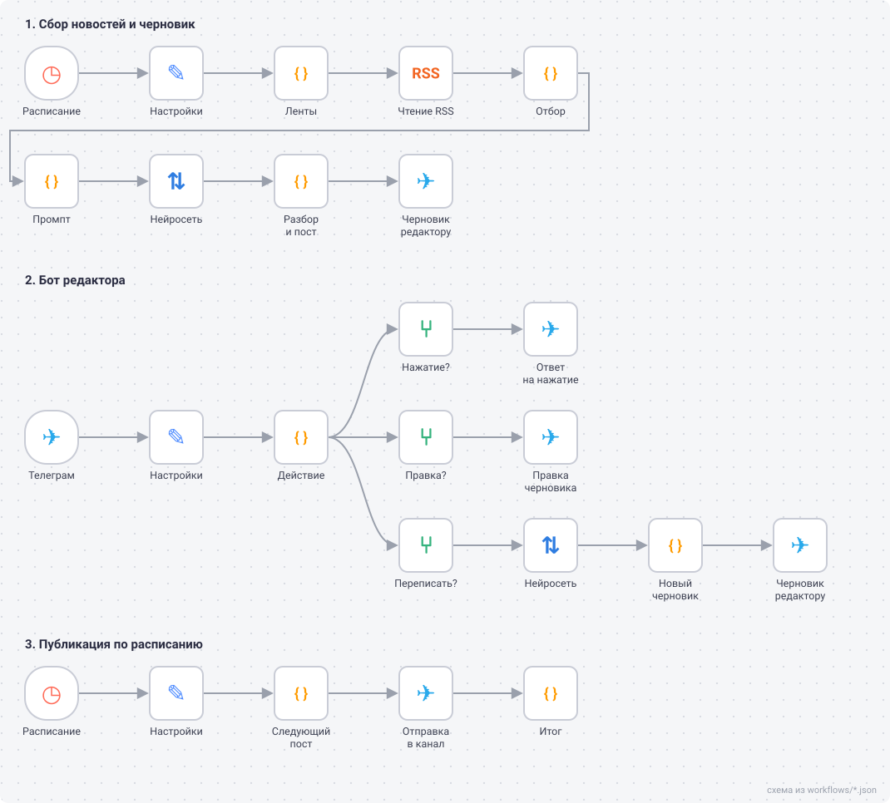

# content-factory

Схема нарисована по файлам конвейеров из `workflows/`.

Вести канал о нейросетях вручную значит каждый день читать ленты, выбирать новости и переписывать их под Телеграм. content-factory берёт рутину на себя, а за человеком оставляет последнее слово: нейросеть готовит черновик, редактор жмёт кнопку, пост выходит по расписанию. Конвейеры на n8n.

**Статус: в работе.** Код узлов и все три конвейера готовы и покрыты тестами, проверка в живом n8n идёт сейчас.

## Как работает

1. **Сбор, раз в три часа.** Ленты RSS из `src/sources.json`, отбор по ключевым словам, повторы ссылок и похожие заголовки за 14 дней отсеиваются. Подходящая новость уходит в нейросеть, и редактору в бот приходит черновик поста с кнопками.
2. **Бот редактора.** «Опубликовать» ставит пост в очередь. «Отклонить» убирает его, причину можно написать ответом на черновик. «Переписать» отправляет черновик обратно в нейросеть с вашей пометкой, например «короче, без цифр».
3. **Публикация, раз в 15 минут.** Первый пост из очереди уходит в канал, но не чаще раза в час и не ночью.

Всё, что не прошло, лежит в журнале с причиной: стоп-слово, похожий заголовок, низкая оценка, ошибка нейросети.

## Как запустить

Нужны Docker, бот Телеграма с правом публикации в канале, ключ нейросети с интерфейсом OpenAI (Groq, GigaChat и другие) и публичный адрес HTTPS для n8n, без него Телеграм не пришлёт нажатия кнопок. Пошагово в [docs/setup.md](docs/setup.md).

## Разработка

Код узлов лежит в `src/` обычными файлами, `npm run build` вклеивает его в конвейеры. Ключи хранятся в учётных данных n8n и в файлы конвейеров не попадают. 89 тестов (`npm test`), нужен Node 20 или новее.
